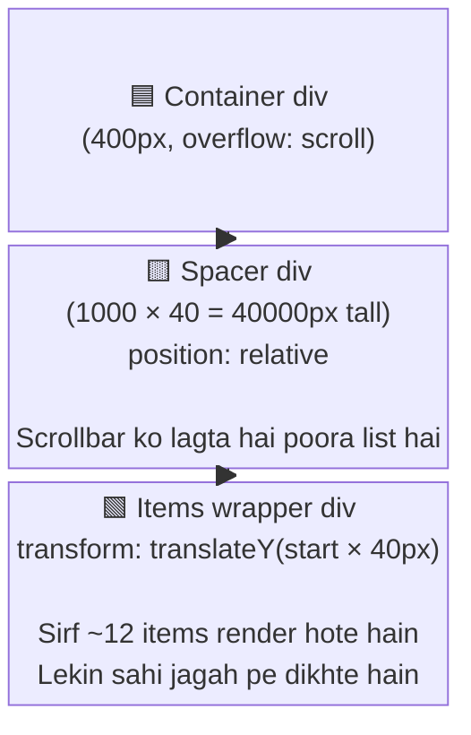
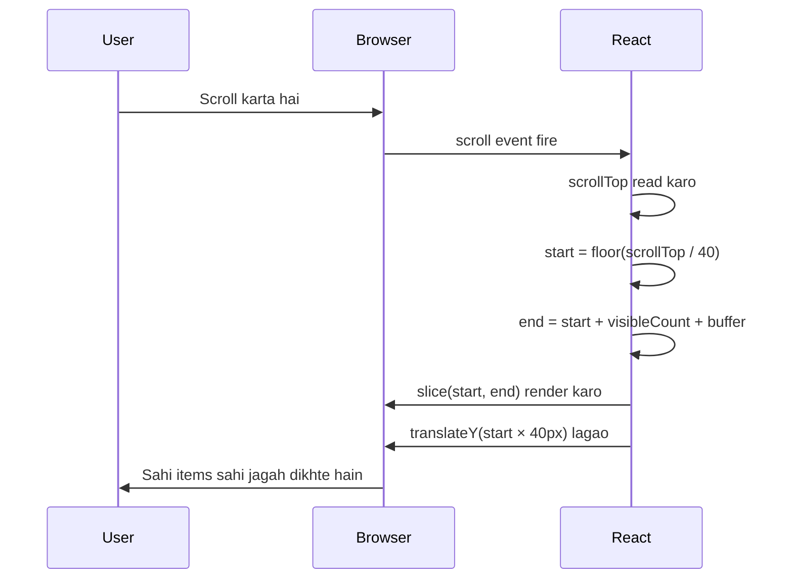

## Virtual Scrolling — Sirf Jo Dikhna Chahiye, Wahi Render Karo

1000 items DOM mein daalo toh browser rota hai. Virtual scrolling mein sirf **screen pe jo dikh raha hai wahi render hota hai** — baaki ka sirf illusion hai.

---

### Structure

---

### Scroll pe kya hota hai?

---

### translateY kyun zaroori hai?

Bina offset ke items hamesha spacer ke **top pe** render hote hain. Scroll karo item 500 pe — items wahi rahenge upar. `translateY(start * itemHeight)` unhe spacer ke andar sahi position pe push karta hai.

---

### Buffer kyun?

Fast scroll pe React ko render karne ka time chahiye. Buffer = thoda aage aur peeche bhi render karo taaki blank flicker na aaye.

---

> **DOM mein sirf ~12 nodes.** Scrollbar ko lagta hai 1000 hain. Dono khush.
